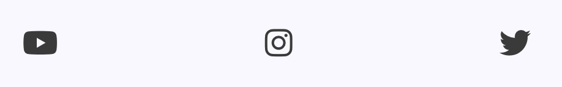

# LA-MASIA

 

La Masia means "The FarmHouse" in spanish.
It is the Youth Acadmey for Barcelona Football Club, site captures the vibrant & nostalgic colours of Barcelona, & expresses an overall outlook of the Acadmey's company culture. 
The site is targeted at people wanting to join the Academy or to gain some foundational knowledge on what the academy offers.

The site is a four page site, 

1. Home page.
2. Apply page.
3. Thank You page.
4. Contact page.

## Table of contents 
[Introduction](#LA-MASIA)
[Wire-Frames ](##Wire-Frames)
[Goals](##Visitor-Goals)
[VisualDesign](##Visual-Design)
[Page1](##Page1)

## **Wire-Frames**

https://drive.google.com/drive/folders/1kERoNuU3A_wM3SAr-ZprlE1rHtJEJPPp?usp=share_link

## Visitor-Goals 
* People who want to apply for the Academy
* People who want to understand foundational knowledge of La Masia
* People who want to view the photo gallery
* People who want to get contact information

## User Goals
* The application form is easy to fill in and works with a return button & clear info on what happens next in your application process. 
* Reads the company ethos in what makes La Masia inidividual, gets an overview.  
* Can Contact La Masia
* Keep updated with La Masia's latest student success.
* Connects to socials 

## La Masia fills the needs of the user by. 

* Very vibrant first page which captures the feeling of the brand. La Masia generating from Spain expresses Blue and Peach colours which are very welcoming & warm to the users eye. 
* First photo show's a togetherness & a glimpse of the facilities to keep the user wanting more.
* A question put forward to the user straight away keeping them intrigued 
* Another photo showing the winning mentality of La Masia
* Highlights the page your'e on when on the navigation bar
* A easy on the eye form to fill in on the Apply page.
* Company ethos on the first page, giving you broader knowledge. 
* Photo collage on the 2nd page. 

## Business goals

* Expand La Masia's student intake
* Have more people know about the light history of La Masia
* Connect to socials
* Contact page emails/ locations.
* Let the customer know when they'll receive an email after filling in the form. Clear communication.

## User Stories
* Expect to gather more of an outlook about La Masia.
* Expect more information on how to apply.
* Expect to see student success.
* Expect to see a little bit of facillities.
* Expect links to social media
* Expect a contact page.

## Visual-Design
 Fonts:
 I decided on using the OSWALD font for the whole page.
 I personally feel the Oswald font is quite striking, and bold. 
 The text is solid & definite, it is giving the User information that they may then applicate. So it needs to be direct & clear, I personally feel Oswald offers that visually. 
 
  

 ## Icons 
 * I used the website https://fontawesome.com/ for the icones in use on the site.
 * They are utilised as classes in the <i> tag.
 * I used them for company-ethos on the first page. 
 * They are also uses for socials in the footer.

  
 
  
  

 ## Colours

 * I wanted the site to have an exciting aesthetic. The city of Barcelona is very passionate, & warm. The colours I've used on the site connect with that also the tradtional colours of the football kit. 
 * The primary colour used is an offwhite. Just to keep everything readable & not overwhelming as a lot of the colours are very bright in the images due to La Masia's kit colours. 
 * There's 2 constant reoccuring colours they are blue and peach. They are contrasting & compliment each other, where strong titles are in blue, the form for example which is the main feature of the 2nd page is in the peach colour.
 * Text is primarily written in a slick gray colour to strike against the off white background & to keep the website professional. 
 * The Title has a 2 tone of yellow and orange to capture the feel of the La Masia shirt within the title. 

 

## Images 
* The site is very image heavy. I have tried to capture images of famous players aswell as facillities & the youth team. 
* They can easily be seen on any device, though their size does adjust on a few of them you still capture the richness and meaning of the image even with the resize. 
* They are spaced out with text to give every image it's significant moment leadings the users thought pattern until the photo collage on the 2nd page. 

## Features

Page Elements

Elements that cover all pages.

* 1. The Nav Bar
* 2. Title/ Header
* 3. Footer
* 4. Background

1. The Nav bar highlights the page you're on in blue, with the option of 3 pages. Whilst not currently on them pages they will show up with the peach colour underlined. On smaller devices, the nav bar comes back to the middle to make it more readabale, on bigger devices it floats to the right. 

 

2. Title:
The two tone title appears on every page bringing continuity feeling to every page the user is on. 

Footer:

The footer is located at the bottom of every page, using Icons connecting to socials media. 
It is slick and easy to see contrasting to the offwhite background. 
Youtube, Instagram, Twitter are the three pages targeted.

Background: The background is Off White 
 

#BREAKING DOWN THE MAIN CONTENT. 

## Page1

The Welcome Image:

The first thing the user connects to is the welcome image. 
The image chosen tells you what La Masia is straight away. 
A football pitch in sight, team work & numbers on the back of the shirt, two players walking back asif they've scored a goal. 
An eclectic mix of colours which are pleasing on the eye. 
* The image has a 2 second zoom.
* The image changes size depending on responsivness but keeps the richness and meaning alive.

Middle of the page #1:

"Why La Masia"? Question.
Bring in the user with a question to keep them intrigued to reading more.
Bring a boldness to the colouring and font so the question feels direct to the user. 

Middle Image:

The Youth of La Masia celebrating after a goal.
This leads us into the middle section of the page company culture split into 3 different paragraphs.  
Keeping it exciting, the first image brings a calmness in contrast, the 2nd image is the youth celebrating a goal- bringing togetherness & a feeling of unity to the wesbite. 

Company culture:

1- Scholarships: 

2- Coaching

3- Graduation 

*The text changes with responsivness, then line layout becomes smaller making it adapatable for the smaller screens. 

 

About section: 
Once the company ethos is understood, if the user is to continue reading they can go into a bit more depth with an overall picture of La Masia.
Catch a bit of brief history, explain the structure of La Masia & encourage you to apply if you're looking at the page for this reason .

There is a contrasting colour to the background, using grey with the text keeping it slick and professional so when the User knows there's more serious detailed information it shown in more of a regular colour.

The last image: 

This captures one of the greatest ever footballers, that being the last thing the user looks at, Lionel Messi completly captures what La Masia is about going through the youth team into a 15 year + professional contract at elite level football. 
So what better than to finish the home page with the greatest example. 

## PAGE 2 RESPONSIVENESS

Heading: "Apply now for La Masa" 
This encourages the user to take action, with a well displayed form beneath it.

Form: 
* The form has a peach colour to it and white writing to create a stress free feeling for the user with its colour. 
* The instructions are simple, when you get to the gender button. The form is well constructed so you can click one or the other not both. 
* The 2 buttons at the bottom of the form are designed in a different colour so it's clear to the user it's not something to fill in but to take action. 
* The reset button resets the form. 
* The Submit but will take you to the next page.
* The form is adaptable to different sizes.
It keeps its shape & is the main feature/purpose of the page.

Training image:
* Getting the user used to seeing facillities is important, so they can connect to the day to day life in La Masia & get a sneak peak at the facillities. Doesn't give away too much, but also brings some life to the middle of the page

Previous student success & photo collage.

* Now driving towards the bottom of the page, I think it's vital for the Academy to mention the key players that have gone on to be successful. This show's proof to anyone wanting to apply, recent graudates and older graduates success. 

* Recgonisable faces create an ease to the user.
  The end of the page again consistent to the first page having a photo to engage with the user the and celebrate it's players.  

## Page 3 Thank You

* This page connects from page 2 & the button redirects the user back to the form.
* It keeps the flow of the website smooth.
* It has clear text informing the user of important information which is why again it's in the grey font.
* It's spaced out clarly so it fills up the page, it's the most simple page of the website. 

## Page 4 Contact Page

* The contact page is short and sweet, it show's La Masia Locations & Email adresses for contact. 
* With it being important info for the user the grey colour is used which is then contrasted using the peach colour for the adresses. 
* Some people may just be coming on the site for this info, so I tried to keep it as informative as possible. 

## Technologies Used
1. Html 
2. CSS

## Libraries
1. Google Fonts
2. Font Awesome

## Platforms:

1. Gitpod
2. Github

## Testing:

IMPORTANT:
Since the prettier extension has been added to gitpod, it comes up with warnings on the html validator. 
 *info- "trailing slash on void elements"*

There are no errors in on of the HTML pages  & without prettier no warnings. All pages are completly clear. Everytime I delete the slash form any syntax, it resaves it with the slash.
Prettier extension was helped installed by my mentor Rory & also followed up with a tutor from Code Institute. 

* I have tested all the html, it has been validated with WC3 HTML5 Validator.
* I have tested the CSS in the W3 Validator.
* Prettier Extension.

## General Testing: 
* Each time a feature was added, all the functions were tested to see if there was an impact.
* The site was sent to friends and family to test on all platforms for resposiveness. 
* Buttons checked they're working and connecting to the right pages. 
* Every step of the form has been tested. 
* Thank you page returns you back to the Apply page.

## Bugs: 
* Resized photos so they load quicker 
* The form wouldn't drag across with the website, fixed in the CSS.
* The Male/female buttons on the form weren't switching again fixed in the CSS.

## Git Commits
Since the start of the resubmission the commits have been more often and more detailed in description to the actions taken.  rather than big commits less often which was happening before hand. 

## Deployment:

Git Hub Deployment: 
Github Preparation - It is possible to copy or clone the repository to directly for deployment, but you will have to compile the make sure the SCSS compiles correctly first. Github Pages' Jekyll themes support this but you will have to make some customisations. Details can be found here. Requirements:
* A free GitHub account.
* A free EmailJS account.

Git Hub instructions: 
1. link to this project https://sammaxfleet.github.io/LA-MASIA-PROJECT-1/
1. log into you github account- https://sammaxfleet.github.io/LA-MASIA-PROJECT-1/
2. You can set up your own repository and copy it.
3. git add, git commit and git push to a GitHub repository, if needed.
4. The master branch will update by default in github pages.
5. Go to the Settings page of the repository.
6. Scroll down to the Github Pages section.
7. Select the Master Branch as the source and Confirm the selection.

## Credits:

Credit: Code Institue love running project for the text on the home page with the icons, some of the form css, & ide of the photo collage.

Websites I used to help me with the site:

https://fonts.google.com/

https://fontawesome.com/
Google for images. 

https://www.geeksforgeeks.org/

https://www.w3schools.com/

https://developer.mozilla.org/en-US/docs/Web/CSS/background-size

https://www.rapidtables.com/web/css/css-color.html

## CONTACT:

samuelfleet@yahoo.co.uk